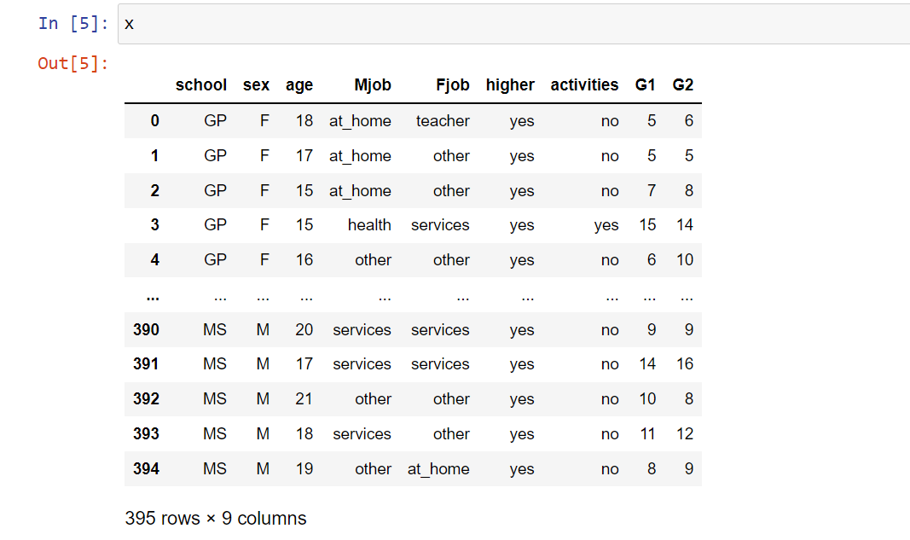
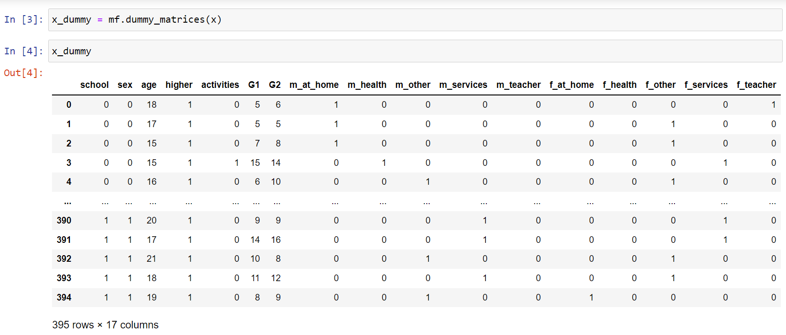
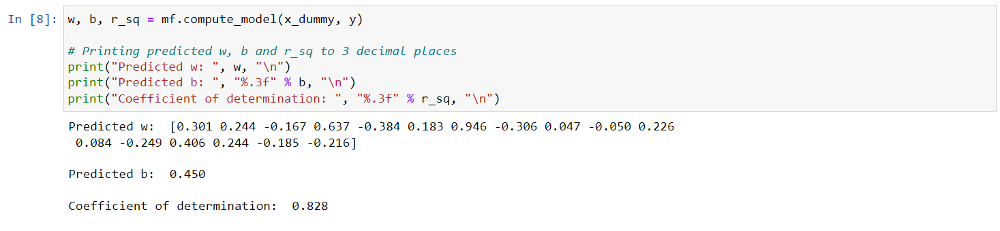
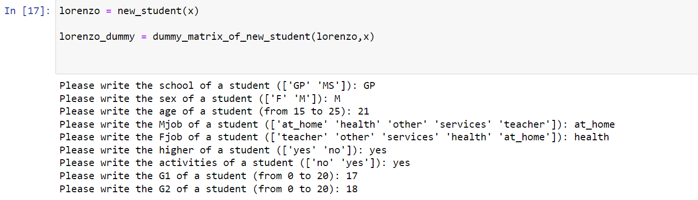
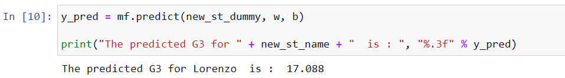
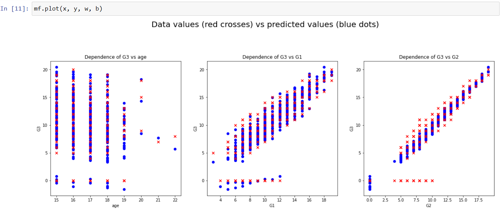

# Building a Linear Regression model to predict final grades of students

In this project I applied Machine Learning to create an algorithm that builds a linear regression 
model based on a dataset of students. To train the model the LinearRegression class is used. The main strategy was to create a module where the algorithm actually runs, a module with all necessary functions that are used in the algorithm, and to perform testing for each function. As a result, the algorithm is able to predict a new student's final grade for a certain subject.


> "We are not... leaving... without... the data!"
>
> *- doctor Brand, Interstellar*

## Introduction

### Linear Regression Tutorial
This section represents a brief theoretical background of linear regression and how to implement 
it in Python. Suppose that one has a set of observations (**examples**) that possess some 
information (**features**) of each observation. For example, it could be a dataset of people, 
whose features are their gender, age, working experience, level education and salary. Then regression analysis is used to find a relation between such features and, given a new example, to predict a value of a certain feature on 
the basis of other features. The function that determines the dependence between features is 
called a **model**. The feature that we want to compute is called the **output** or the 
**target** of the model and the other features that are put into the model as parameters, are 
called the **input** to the model (often input is also called **features** or **input features**). 
The whole set used to *train* a model is called the **training set** and the predicted output is called a 
**prediction** or **estimation**.

Linear regression uses linear dependence of a target on input features. That is to say, when there 
are m input features $x_1, x_2, x_3, \ldots , x_m$ and a target $y$, the linear regression model is represented by the following function:

$$ y = w_1 \cdot x_1 + w_2 \cdot x_2 + w_3 \cdot x_3 + \ldots + w_m \cdot x_m + b $$

where ${w_1, w_2, w_3, \ldots , w_m}$ and $b$ are **parameters** or **weights** of the model. Therefore, the goal of linear regression analysis is to find such parameters that would capture the dependence between y and $x_1, x_2, x_3, \ldots , x_m$ as accurately as possible. 
Using the computed (trained) parameters, it is possible to create the linear model and to predict y on new values of $x_i, i = 1 \ldots m$.

In order to estimate the accuracy of your model, the **coefficient of determination** $R^2 \in [0.1]$ is used. A larger $R^2$ indicates a better fit and the largest value $R^2 = 1$ corresponds to a perfect fit, when the vaues of actual target and predicted target fit completely to each other.  


### Problem Statement
The goal of this project was to create a linear regression model to predict the final grade of a 
student. For this purpose I used a database of students from two high schools in Portugal. Using 
this model, I managed to predict a new student's final grade for a certain subject. 

This project uses two datasets, however, it is possible to apply the algorithm to other datasets 
with the same features. The dataset "student-mat.csv" contains students' grades in Math, 
the dataset "student-por.csv" contains students' grades in Portuguese. Both datasets consist of 
32 columns, each of which describes certain information about a student (his/her age, gender, mother's 
and father's working activities, whether he/she has access to Internet at home etc.). However, in this 
project only 10 columns (or features) are used. Below these features and their possible values 
are presented:

* school - student's school (binary: "GP" - Gabriel Pereira or "MS" - Mousinho da Silveira)
* sex - student's sex (binary: "F" - female or "M" - male)
* age - student's age (numeric: from 15 to 22)
* Mjob - mother's job (nominal: "teacher", "health" care related, civil "services" (e.g. administrative or police), "at_home" or "other")
* Fjob - father's job (nominal: "teacher", "health" care related, civil "services" (e.g. administrative or police), "at_home" or "other")
* higher - whether a student wants to take higher education (binary: yes or no)
* activities - extra-curricular activities (binary: yes or no)

These grades are related with the course subject, Math or Portuguese:
* G1 - first period grade (numeric: from 0 to 20)
* G2 - second period grade (numeric: from 0 to 20)
* G3 - final grade (numeric: from 0 to 20, output target)

The input to the model includes ["school", "sex", "age", "Mjob", "Fjob", "higher", "activities", 
"G1", "G2"], the output of the model is the final grade "G3". Since some of the features are 
categorical (i.e. have non-numeric values), before giving them to the model, it is necessary to 
turn categorical features into numeric features. To do so, dummy matrices are used. 

Dummy matrices are a set of columns that replace a single categorical feature. Each column 
represents one of the feature values and has indicators 1, if a training example has 
this feature value, or 0, if the example does not have this feature value. A simple schematic 
illustration of dummy matrices is represented below. In order to split categorical features into 
dummy matrices, `get_dummies()` method is used.

<p align="center">
  
</p>


Once the input dataset is numeric, it is possible to train a linear regression model. 


## Structure of the project

In the project there are three folder. **/data** contains datasets that can be used in the linear regression analysis: "student-mat.csv", "student-por.csv" and "student.txt", where additional information about the datasets is shown. In case there are new datasets, a user should add them to the */data* folder. **test_data** includes data used for testing functions. **Images** contains all images used in the *README.md* file.

This project includes three Python code files: **main.py**, **my_functions.py** and **test_my_functions.py**. In *main.py* I trained the linear regression model, plotted the dependence of target feature on numeric features and to predicted the final grade for a new student. *my_functions.py* contains all functions that were employed in *main.py*. *test_my_functions.py* is used to test the functions. Below there is a brief description of each .py file.

### my_functions.py
This file includes all functions and their documentation that are not present in external modules and that are used in main.py.

* load_data() - loads a .csv file and splits it into input x and output y
* dummy_matrices() - splits categorical features of x into dummy matrices
* compute_model() - fits the model with LinearRegression class and computes weights w,b and the coefficient of determination r_sq 
* new_student() - creates features of a new student
* dummy_matrix_of_new_student()  - splits the new student's categorical features into a dummy matrix
* predict() - using computed w and b, estimates the final grade for the enw student
* plot() - plots dependences of the final grade on numeric features of the input

It is worth noting that in `new_student()` I raised the age limit to 25 years in order to make the choice more diverse. 

### main.py
First, I imported *my_functions.py* module to get access to all necessary functions. In order to turn off **SettingWithCopyWarning alert**, I set the option `mode.chained_assignment` to `None`. In order to print the trained parameters w as `numpy.ndarray` to 3 decimal places, I used the `np.set_printoptions()` method.

```
from my_functions import *

pd.set_option('mode.chained_assignment', None)  # To turn off SettingWithCopyWarning
np.set_printoptions(formatter={'float': lambda x: "{0:0.3f}".format(x)})  # To print the predicted w to 3 decimals places
```

To perform the linear regression, I used the "student-mat.csv" file. Using load_data(), I splitted the dataset into the input features array `x` and target feature `y`. Then I used `dummy_matrices()`to turn categorical features of `x` into dummy matrices. As a result, the function returned `x_dummy` with replaaced columns.

```
x, y = load_data("data/student-mat.csv")
x_dummy = dummy_matrices(x)
```

After that the training set (`x_dummy`, `y`) was ready to insert into `compute_model()` as parameters to calculate the weights of the model. 

<p align="center">
  
</p>

<p align="center">
  
</p>

Once (`x_dummy`, `y`) were given to `compute_model()`, it returned trained weights `w`, `b` and the coefficient of determination `r_sq`. As seen below, `r_sq` is higher than 0.8 what represents a good linear fit.

<p align="center">
  
</p>

Given the trained weights, we can now use the model for new examples. Let us consider a new student Lorenzo, whose final grade needs to be estimated. In order to type into Lorenzo's features, I used the function `new_student()` which determines a new student's features analogous to features in the input `x`:

```
lorenzo = new_student(x)
```

<p align="center">
  
</p>"

After defining Lorenzo's features, I converted his categorical features into dummy matrices using `dummy_matrix_of_new_student()`:

```
lorenzo_dummy = dummy_matrix_of_new_student(lorenzo,x)
```

In order to estimate Lorenzo's final grade, I applied `predict()` and assigned the returned value to `y_pred`:

<p align="center">
  
</p>

Lastly, in order to visually verify the accuracy of the trained model, `plot()` was used. In case of the dataset "student-mat.csv" the figures are the following:

```
plot(x, y, w, b)
```

<p align="center">
  
</p>

As seen from the graphs, the model relatively well found the relation between students' features and their final grades.


### test_my_functions.py
This module is used to test the functions from *my_functions.py*. I chose **pytest** as a testing library. There are at least two unit tests for each function (except for `plot()`) that reflect a typical use case and a limit use case. Below there is a list of all testing functions from *test_my_functions.py*. Each testing function has a brief documentation inside the module.

For `load_data()`:
* test_data_load_correctly()
* test_data_load_limit_case()

For `dummy_matrices()`:
* test_dummy_matrices_performed_correctly()
* test_data_with_dummy_matrices_has_no_categorical_features()
* test_dummy_matrices_do_not_change_data_with_numeric_values()

For `compute_model()`:
* test_compute_model() 
* test_compute_model_with_single_point()

For `new_student()`:
* test_new_student()
* test_two_new_students()

For `dummy_matrix_of_new_student()`:
* test_dummy_matrix_of_new_student()
* test_dummy_matrix_for_new_student_has_no_categorical_features()

For `predict()`:
* test_predict()
* test_that_predicted_output_higher_than_twenty_notified()

For `plot()`:
* test_plot()


**NOTE** The tests `test_new_student()`, `test_two_new_students()`, `test_dummy_matrix_of_new_student()` and `test_dummy_matrix_for_new_student_has_no_categorical_features()` contain the *new_student()* function which contains an interactive function *input()*. Therefore, in order to pass these tests, they should be called separately with the `-s` flag. For example,

```
pytest test_my_functions.py::test_new_student -s
```

## Conclusion
To sum up, the constructed algorithm relatively well finds the relation between students' features and their final grades what allows us to estimate the final grade of a new student. This project aims to represent a beginner level to work in the Machine Learning field. Therefore, I hope that this code will help you understand better the linear regression analysis and that you will enjoy the journey.